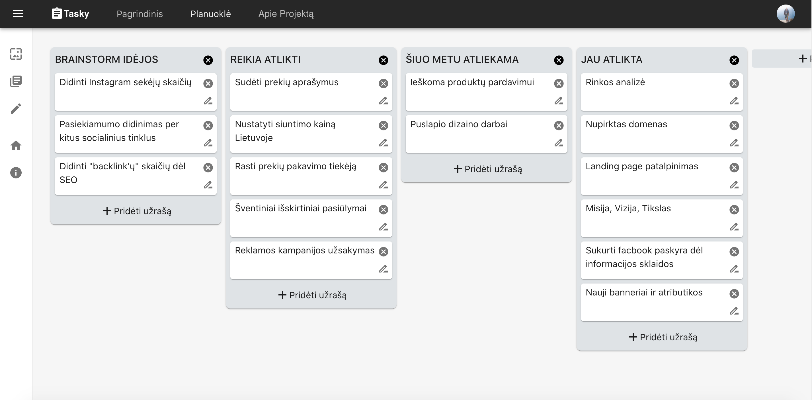

<div id="top"></div>

<!-- PROJECT LOGO -->
<br />
<div align="center">
  <a href="https://github.com/T4dam/Tasky.git">
    
  </a>

<h3 align="center">Tasky</h3>

  <p align="center">
   Virtualus įrankis planuotojams
    <br />
  </p>
</div>


<a href="https://github.com/T4dam/Tasky.git">
 
</a>

<!-- ABOUT THE PROJECT -->
## Apie projektą

Ši sukurta darbų planuoklė - tai būdas padidinti produktyvumą, leidžiantis nieko nepamiršti, padedantis nustatyti užduočių prioritetus, efektyviai valdyti užduotis, išmintingai naudoti laiką ir pagerinti laiko valdymą. Pranašumas prieš kitas tokio tipo planuokles yra tai, jog ji yra nemokama ir pritaikyta Lietuvos auditorijai, todėl užduočių planuoklę gali naudotis ir vartotojai neturintys užsienio kalbos žinių.


### Panaudoti frameworkai:

* [React.js](https://reactjs.org/)
* [Node.js](https://nodejs.org/en/)
* [Express.js](https://expressjs.com)
* [Material UI](https://mui.com)


<!-- GETTING STARTED -->
## Projekto paleidimui reikiamos programos

Projekto pleidimuibus reikalingos šios programos:
- Node.js
- Naršyklė
- Kodo editorius

### Instaliavimas

1. Rankiniu būdu atsiųskite arba klonuokite repozitoriją
   ```sh
   git clone https://github.com/T4dam/Tasky.git
   ```
3. Norint atidaryti "server" folderį, įvykdykite komandą:
   ```sh
   cd server
   ```
4. šio failo direktorijoje, įvykdykite komandą:
   ```sh
   npm install
   ```
5. Tą patį procesą pakartokite kitam folderiui "client"


### Paslapties failo .env įgalinimas
1. Server direktyvoje esančio src folderio viduje sukūrkite naują failą su pavadinimu .env ir įtraukite jį .gitignore aplanką.
2.  Nukopijuokite .env-example viduje esančius failus į.env vidų ir užpildykite po lygybės esančius laukus kaip rodoma pavyzdyje. Reikšmę TOKEN_SECRET nurodykite patys.
```sh
    PUBLIC_PATH=public
    IMG_PATH=images

    SERVER_DOMAIN=http://localhost
    SERVER_PORT=5000
    TOKEN_SECRET=..............
   ```
5. Galite išsaugoti ir pereiti prie projekto paleidimo

### Projekto paleidimas

1. Norint atidaryti "server" folderį, įvykdykite komandą:
   ```sh
   cd server
   ```
3. Serveriui paleisti, įveskite komandą:
* Windows vartotojams:
    ```sh
    npm run start-win
    ```
* Unix sistemos vartotojams:
    ```sh
    npm run start-unix
    ```
4. Tą patį procesą pakartokite kitam folderiui "client"


<!-- USAGE EXAMPLES -->
## Usage

Use this space to show useful examples of how a project can be used. Additional screenshots, code examples and demos work well in this space. You may also link to more resources.

_For more examples, please refer to the [Documentation](https://example.com)_


<!-- CONTACT -->
## Contact

Tadas Delininkaitis- [@LinkedIn](https://www.linkedin.com/in/tadasdelininkaitis/)


<p align="right">(<a href="#top">Grįžti į viršų</a>)</p>
